---

title: 自动内存管理——深入理解JAVA虚拟机（第一部分）
date: 2022-01-03 17:56:50
tags:
categories:
- JAVA
- JVM
---

## Java内存区域与内存溢出

### 运行时数据区域

《Java虚拟机规范》规定，Java虚拟机所管理的内存包括以下几个运行时数据区域。

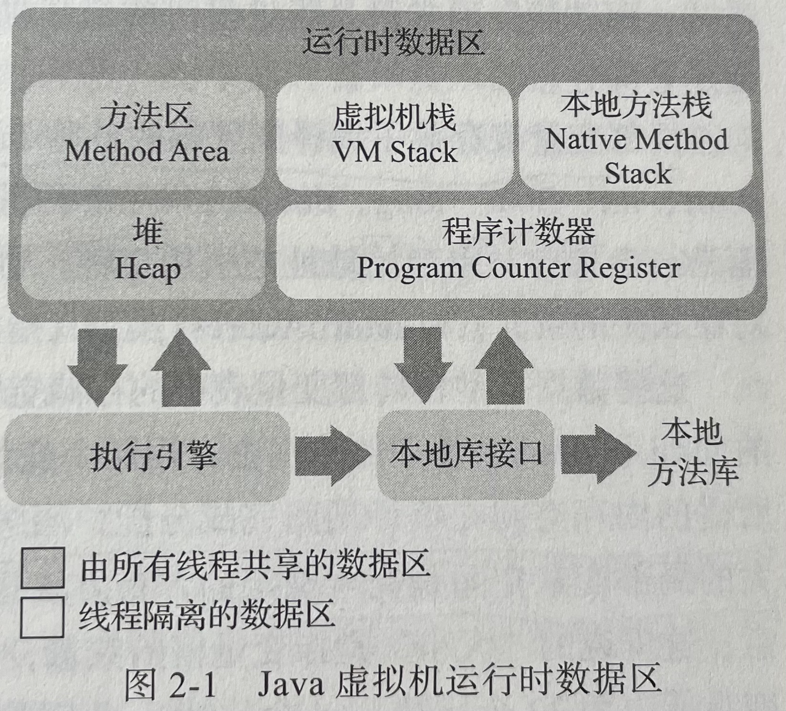

#### 程序计数器（Program Counter Register）

程序计数器可以看作是当前线程所执行字节码的行号指示器。

- 如果线程正在执行的是一个Java方法，这个计数器记录的是正在执行的虚拟机字节码指令的地址
- 如果线程正在执行的是本地方法，这个计数器的值为空（Undefined）

> 本地（Native）方法，Java代码调用非Java代码。

####Java虚拟机栈（Java Virtual Machine Stack）

Java虚拟机栈也是线程私有的，它的生命周期与线程相同。

虚拟机栈描述的是Java方法执行的线程内存模型：每个方法被执行的时候，Java虚拟机内部都会同步创建一个栈帧用于存储**局部变量表、操作数栈、动态连接、方法出口**等信息。每个方法被调用直至执行完毕的过程，就对应着一个栈帧在虚拟机栈中从入栈到出栈的过程。

局部变量表存放了编译期可知的各种Java虚拟机基本数据类型（boolean、byte、char、short、int、float、double、long）、对象引用（reference类型，他并不等同于对象本身，可能是一个指向对象起始地址的引用指针，也可能是指向一个代表对象的句柄或者其他与对象相关的位置）和returnAddress类型（指向了一条字节码指令的地址）。

> 局部变量表所需的内存空间在编译期完成分配，当进入一个方法时，这个方法需要在栈帧中分配的局部变量空间是完全确定的。

该区域可能出现两种异常：如果线程请求深度大于虚拟机允许的深度，会抛出StackOverflowError异常；如果虚拟机栈允许动态扩展，当栈扩展到无法申请到足够的内存会跑出OutOfMemoryError异常。

#### 本地方法栈（Native Method Stacks）

本地方法栈与虚拟机栈类似，区别是虚拟机栈为Java方法服务，本地方法栈为本地方法服务。

本地方法栈抛出的内存异常类型与虚拟机栈一致。

#### Java堆（Java Heap）

Java堆是垃圾收集器管理的内存区域，也叫“GC堆”。堆的大小可以通过`-Xms -Xmx`设定。

从内存分配的角度看，所有线程共享的Java堆可以划分出多个线程私有的分配缓冲区（Thread Local Allocation Buffer， TLAB）。

Java堆中无法分配内存时会抛出OutOfMemoryError异常。

#### 方法区（Method Area）

方法区是多个线程共享的内存区域，它用于存放被虚拟机加载的类型信息、常量、静态常量、即时编译器编译后的代码缓存等数据。

Java8之前方法区也被称为永久代，通过`-XX:MaxPermSize`设置大小，即时不设置也有默认大小。Java8之后通过在本地内存（JVM之外的内存）中实现元空间来代替。

如果方法区无法满足新的内存分配需求，将抛出OutOfMemoryError异常。

#### 运行时常量池（Runtime Constant Pool）

运行时常量池也是方法区的一部分。Java语言并不要求常量一定是在编译期产生，运行期间也可以将新的常量方法放入池中。如String.intern()。

#### 直接内存（Direct Memory）

直接内存并不是虚拟机运行时数据区的一部分，但是这部分内存也被频繁使用，也可能导致OutOfMemoryError异常。

如NIO类引用的基于通道与缓冲区的I/O方式，它使用Native函数库直接分配堆外内存，然后通过一个储存在Java堆中的DirectByteBuffer对象作为这块内存的引用进行操作。

> 如果发现内存溢出之后产生的dump文件很小，而程序中又直接或间接使用了DirectMemory（典型的间接使用就是NIO），就可能是因此导致的。

### HotSpot虚拟机对象

#### 对象的创建
new一个对象：
1. 类加载
如果在常量池中有类的符号引用，就去看类是否被加载、解析和初始化过。如果没有就先进行类加载。

2. 分配内存，并初始化为零
	- 分配内存：“指针碰撞”：空闲和非空闲之间有分割指针；”空闲列表“：维护一个表表示哪些内存可用。
	- 初始化：将分配到的内存空间中，除了对象头以外的部分初始化为零值。

3. 对象设置
对对象进行必要的设置，放在对象头中。包括对象是哪个类的实例，如何找到类的元数据信息，对象的哈希码，对象的GC分代年龄等。

#### 对象的内存布局

对象在堆内存中的储存布局分为三部分：对象头、实例数据、对齐填充。

##### 对象头

对象头包含两类信息：

- 储存对象自身的运行时数据：哈希码、GC分代年龄、锁状态标志、线程持有的锁、偏向线程ID、偏向线程时间戳等。
- 类型指针，即对象指向他的类型元数据的指针。

#### 对象的访问定位

HotSpot主要使用第二种方式

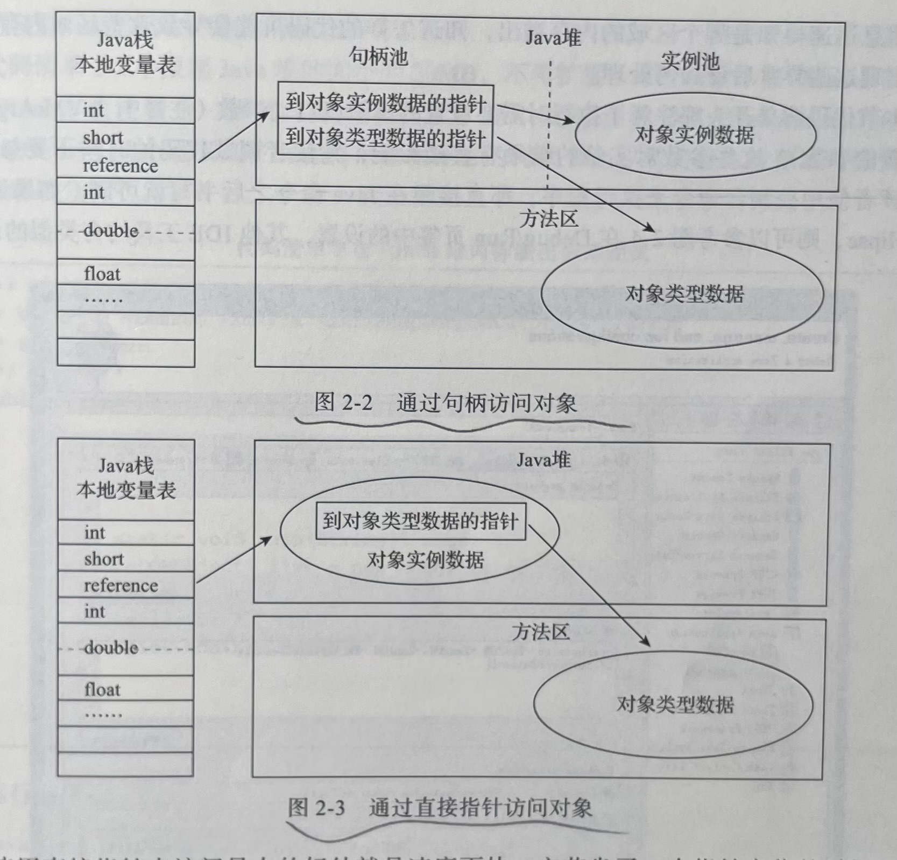

## 垃圾收集器与内存分配策略

在Java内存运行时区域的各个部分，其中程序计数器、虚拟机栈、本地方法栈3个区域随线程而生，随线程而灭，栈中的栈帧随着方法的进入和退出而有条不紊的执行着出栈和入栈的操作。每个栈帧分配多少内存基本上在类结构确定下来就是已知的，当方法结束或者线程结束时，内存自然就跟着回收了。

而Java堆和方法区有着显著的不确定性，一个接口的多个实现类需要的内存可能不一样，一个方法所执行的不同条件分支所需要的内存也可能不一样。垃圾收集器关注的就是这部分内存的管理。

### 判断对象是否存活

#### 引用计数

在对象中添加引用计数器，每当有地方对其进行引用时，计数器值加一，引用失效时，计数器值减一；任意时刻计数器为零的对象就是不可能再被使用的。

#### 可达性分析

通过一系列称为“GC Roots”的根对象作为起始节点集，从这些节点开始，根据引用关系向下搜索，搜索过程所走过的路径称为“引用链”，如果某个对象到GC Roots间没有任何引用链相连，或者用图论的话来说就是从GC Roots到这个对象不可达时，则证明此对象是不可能再被使用的。

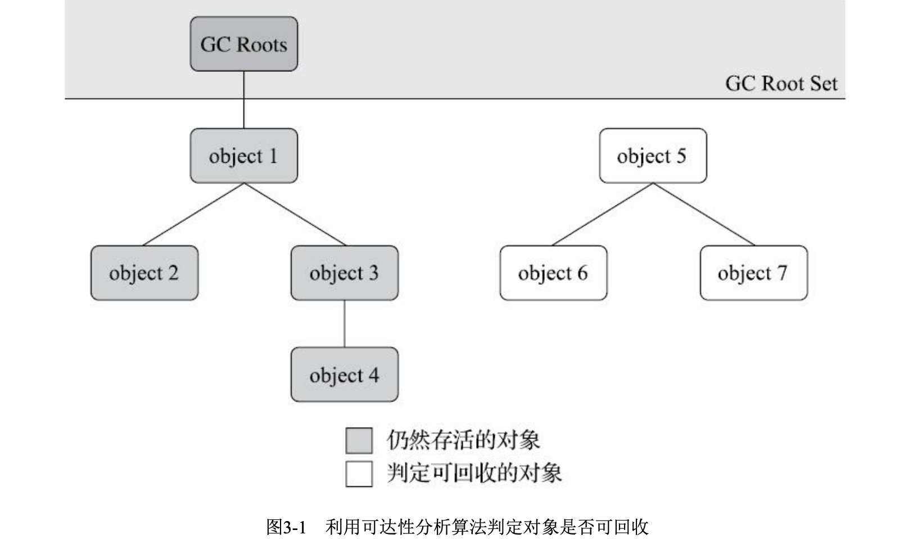

在Java技术体系里面，固定可作为GC Roots的对象包括以下几种:

- 在虚拟机栈（栈帧中的本地变量表）中引用的对象，譬如各个线程被调用的方法堆栈中使用到的参数、局部变量、临时变量等。
- 在方法区中类静态属性引用的对象，譬如Java类的引用类型静态变量。
- 在方法区中常量引用的对象，譬如字符串常量池（String Table）里的引用。
- 在本地方法栈中JNI（即通常所说的Native方法）引用的对象。
- Java虚拟机内部的引用，如基本数据类型对应的Class对象，一些常驻的异常对象（比如NullPointExcepiton、OutOfMemoryError）等，还有系统类加载器。 
- 所有被同步锁（synchronized关键字）持有的对象。 
- 反映Java虚拟机内部情况的JMXBean、JVMTI中注册的回调、本地代码缓存等。

此外，还可以有其他对象“临时性”的加入，共同构成完整的GC Roots集合。

#### Java中的引用

在JDK 1.2版之后，Java对引用的概念进行了扩充，将引用分为强引用（Strongly Reference）、软引用（Soft Reference）、弱引用（Weak Reference）和虚引用（Phantom Reference）4种，这4种引用强 度依次逐渐减弱。

- 强引用是最传统的“引用”的定义，是指在程序代码之中普遍存在的引用赋值，即类似“Object obj=new Object()”这种引用关系。无论任何情况下，只要强引用关系还存在，垃圾收集器就永远不会回 收掉被引用的对象。
- 软引用是用来描述一些还有用，但非必须的对象。只被软引用关联着的对象，在系统将要发生内存溢出异常前，会把这些对象列进回收范围之中进行第二次回收，如果这次回收还没有足够的内存， 才会抛出内存溢出异常。在JDK 1.2版之后提供了SoftReference类来实现软引用。
- 弱引用也是用来描述那些非必须对象，但是它的强度比软引用更弱一些，被弱引用关联的对象只能生存到下一次垃圾收集发生为止。当垃圾收集器开始工作，无论当前内存是否足够，都会回收掉只被弱引用关联的对象。在JDK 1.2版之后提供了WeakReference类来实现弱引用。
- 虚引用也称为“幽灵引用”或者“幻影引用”，它是最弱的一种引用关系。一个对象是否有虚引用的存在，完全不会对其生存时间构成影响，也无法通过虚引用来取得一个对象实例。为一个对象设置虚引用关联的唯一目的只是为了能在这个对象被收集器回收时收到一个系统通知。在JDK 1.2版之后提供了Phant omReference类来实现虚引用。

#### 生存还是死亡？

要真正宣告一个对象死亡，至少要经历两次标记过程：如果对象在进行可达性分析后发现没有与GC Roots相连接的引用链，那它将会被第一次标记，随后进行一次筛选，筛选的条件是此对象是否有必要执行finalize()方法。假如对象没有覆盖finalize()方法，或者finalize()方法已经被虚拟机调用过，那么虚拟机将这两种情况都视为“没有必要执行”。

finalize()方法是对 象逃脱死亡命运的最后一次机会，稍后收集器将对F-Queue中的对象进行第二次小规模的标记，如果对象要在finalize()中成功拯救自己——只要重新与引用链上的任何一个对象建立关联即可。

#### 回收方法区

在Java堆中，尤其是在新生代中，对常规应用进行一次垃圾收集通常可以回收70%至99%的内存空间，相比之下，方法区回收囿于苛刻的判定条件，其区域垃圾收集的回收成果往往远低于此。

可回收的类需要满足三个条件:

- 该类所有的实例都已经被回收，也就是Java堆中不存在该类及其任何派生子类的实例。 
- 加载该类的类加载器已经被回收，这个条件除非是经过精心设计的可替换类加载器的场景，如OSGi、JSP的重加载等，否则通常是很难达成的。
- 该类对应的java.lang.Class对象没有在任何地方被引用，无法在任何地方通过反射访问该类的方法。

关于是否要对类型进行回收，HotSpot虚拟机提供了- Xnoclassgc参数进行控制，还可以使用-verbose:class以及-XX:+TraceClass-Loading、-XX: +TraceClassUnLoading查看类加载和卸载信息，其中-verbose:class和-XX:+TraceClassLoading可以在Product版的虚拟机中使用，-XX:+TraceClassUnLoading参数需要FastDebug版的虚拟机支持。

### 垃圾收集算法

#### 分代收集理论

三个分代假说：

- 弱分代假说：绝大多数对象都是朝生夕灭的。
- 强分代假说：熬过越多次垃圾收集过程的对象就越难以消亡。
- 跨代引用假说：跨代引用相对于同代引用来说只占极少数。

> **垃圾收集分类**
>
> - 部分收集(Partial GC):指目标不是完整收集整个Java堆的垃圾收集，其中又分为:
>
>     - 新生代收集(Minor GC/Young GC):指目标只是新生代的垃圾收集。
>
>     - 老年代收集(Major GC/Old GC):指目标只是老年代的垃圾收集。目前只有CMS收集器会有单独收集老年代的行为。另外请注意“Major GC”这个说法现在有点混淆，在不同资料上常有不同所指， 读者需按上下文区分到底是指老年代的收集还是整堆收集。
>     - 混合收集(Mixed GC):指目标是收集整个新生代以及部分老年代的垃圾收集。目前只有G1收集器会有这种行为。
>
> ·整堆收集(Full GC):收集整个Java堆和方法区的垃圾收集。

#### 标记-清除法

标记-清除法：标记出所有需要回收的对象，在标记完成后，统一回收掉所有被标记的对象，也可以反过来，标记存活的对象，统一回收。

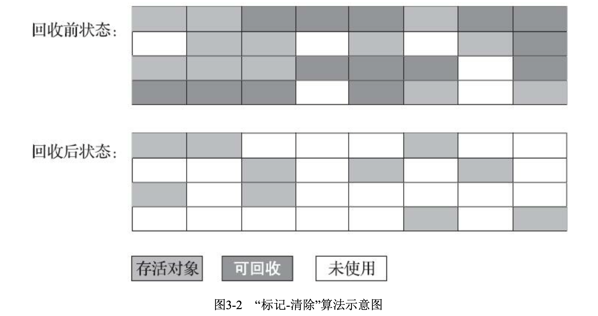

缺点：

- 执行效率不稳定，大量对象回收时，随对象数量增长而降低。
- 空间碎片化。

#### 标记-复制法（大部分新生代算法）

**Appel式回收**的具体做法是把新生代分为一块较大的Eden空间和两块较小的 Survivor空间，每次分配内存只使用Eden和其中一块Survivor。发生垃圾搜集时，将Eden和Survivor中仍 然存活的对象一次性复制到另外一块Survivor空间上，然后直接清理掉Eden和已用过的那块Survivor空间。

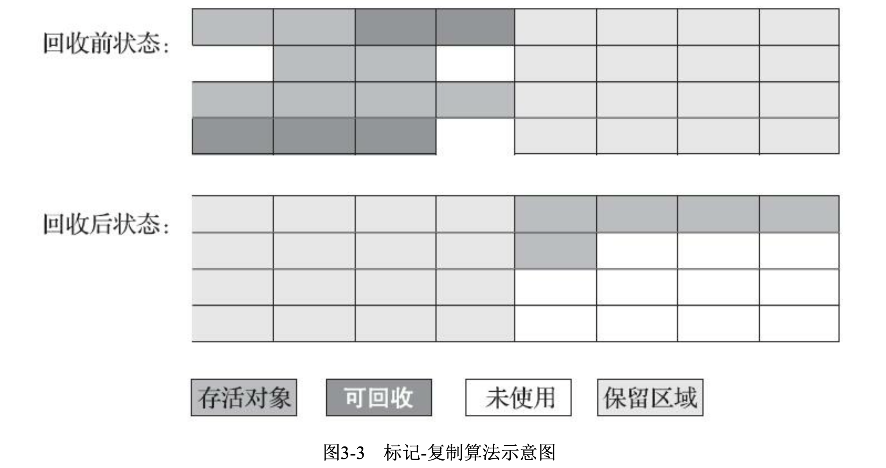

#### 标记-整理算法（大部分老年代算法）

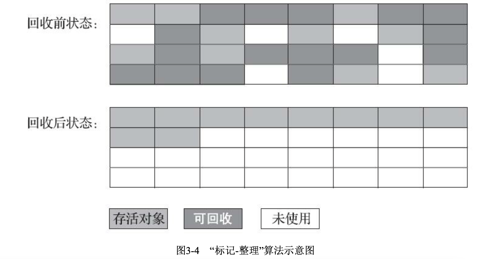

> HotSpot虚拟机里面关注吞吐量的Paralle Old收集器基于标记-整理算法，而关注延迟的CMS收集器则是基于标记-清除算法的（在空间碎片过多时，再采用标记-整理算法收集一次）。

### HotSpot的算法实现细节

#### 根结点枚举

迄今为止，所有收集器在根结点枚举这一步骤时都是必须暂停用户线程的。

获取对象引用：HotSpot使用一组称为OopMap的数据结构来达到查找对象引用的目的。

#### 安全点

在垃圾回收时，需要让所有线程（不包括JNI调用的线程）在最近的安全点停顿下来。

有两种方案：

- 抢先式中断：垃圾收集时，系统把所有用户线程中断，如果有的线程不在安全点，恢复这条线程，让他跑到安全点后中断（几乎没有使用这种方案的回收器）
- 主动式中断：设置一个标记位，让各个线程轮询标记位，如果标记位为真，就在最近的安全点挂起。

#### 安全区域

在一些时间内，如果程序不执行，也可以认为可以进行停顿。如Sleep或者Block状态。

安全区域是指能够确保在某一段代码片段中，引用关系不会发生变化。

#### 记忆集与卡表

**记忆集**是一种从非收集区域指向收集区域的指针集合的抽象数据结构。

记忆集与卡表——在实现记忆集时，可以采用更粗的粒度进行储存：

- 字长精度:每个记录精确到一个机器字长(就是处理器的寻址位数，如常见的32位或64位，这个 精度决定了机器访问物理内存地址的指针长度)，该字包含跨代指针。

- 对象精度:每个记录精确到一个对象，该对象里有字段含有跨代指针。 
- 卡精度:每个记录精确到一块内存区域，该区域内有对象含有跨代指针。

> 卡表：在垃 圾收集发生时，只要筛选出卡表中变脏的元素，就能轻易得出哪些卡页内存块中包含跨代指针，把它 们加入GC Roots中一并扫描。
>
> 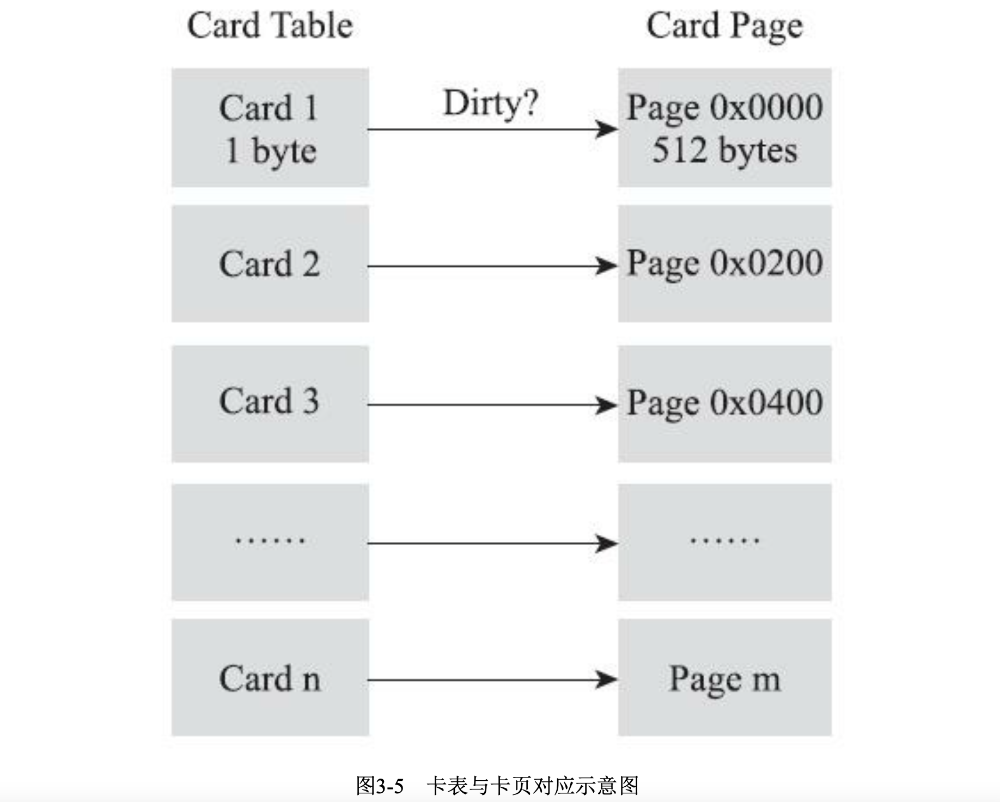

#### 写屏障

在HotSpot虚拟机中是通过写屏障技术维护卡表状态的。

伪共享问题：现代中央处理器的缓存系统中是以缓存行为单位存储的，当多线程修改相互独立的变量时，如果这些变量恰好共享同一个缓存行，就会彼此影响而导致性能降低。（解决：JDK7以后HotSpot提供-XX:+UseCondCardMark来决定是否开启卡表更新判断，开启后会额外增加一次判断）

#### 并发可达性分析

根结点枚举带来的停顿非常短暂且相对固定。但遍历对象往往需要非常长的STW。

可达性分析通常采用三色标记法进行，但会出现“对象消失”问题（原本是黑色的对象被标记为白色）。两种解决方案：增量更新和原始快照。

### 经典垃圾收集器

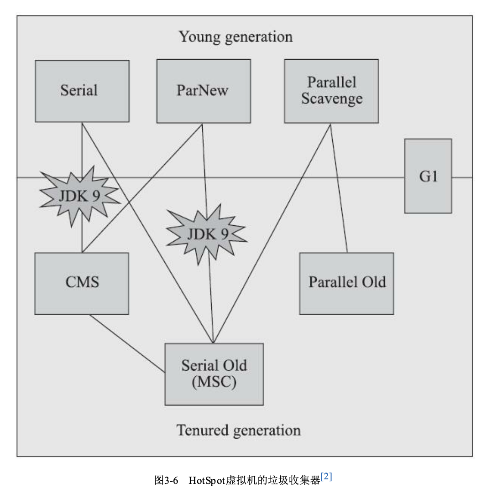

#### Serial收集器

在垃圾收集时，暂停其他所有工作，直至暂停结束。

迄今为止，他仍是客户端模式下的默认新生代收集器，由于他简单、高效、内存消耗少、没有线程交互开销。

对于几十～一两百兆的新生代，大约停顿在百毫秒以内。

#### ParNew收集器

Serial收集器的多线程版本。

被大多JDK7之前的版本使用，因为只有他可以和CMS一起工作。

#### Parallel Scavenge收集器

Parallel Scavenge收集器的目的是控制吞吐量。

吞吐量=运行用户代码的时间/（运行用户代码的时间+运行垃圾收集的时间）

可以通过参数`-XX:MaxGCPauseMillis`控制最大垃圾收集停顿时间以及`-XX:GCTimeRatio`控制吞吐量的大小。

垃圾收集停顿时间缩短是以牺牲吞吐量和新生代空间为代价的（新生代更小，单词停顿减小，但是GC更频繁）。

#### Serial Old收集器

Serial收集器的老年代版本，使用标记-整理算法。CMS收集器失败时也会调用。

#### Parallel Old收集器

Parallel Scavenge收集器的老年代版本，基于标记-整理算法实现。

#### CMS收集器

CMS（Concurrent Mark Sweep）收集器是一种以**获取最短回收停顿时间**为目标的收集器。

基于标记-清除算法实现，分为四步：

- 初始标记（CMS initial mark）：标记GC Roots能直接关联到的对象
- 并发标记（CMS concurrent mark）：遍历对象图，与用户线程并发
- 重新标记（CMS remark）：修正并发标记期间对象变动产生的影响
- 并发清除（CMS concurrent sweep）：清除死亡对象

初始标记和重新标记需要“Stop the world” （STW）。

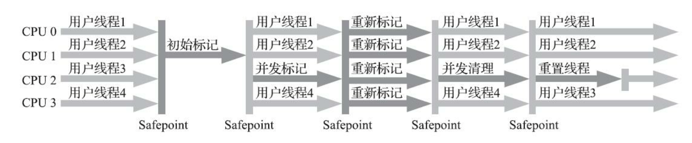

缺点：

- 对处理器资源敏感，默认回收线程数=（处理器核心+3）/4，核心数不足4个时，CMS对用户程序的影响就可能很大
- 无法处理浮动垃圾，从而导致完全STW的Full GC。

#### Garbage First收集器

G1收集器可以面向堆内存任何部分来组成回收集(Collection Set，一般简称CSet)进行回收，衡量标准不再是它属于哪个分代，而是哪块内存中存放的垃圾数量最多，回收收益最大，这就是G1收集器的Mixed GC模式。

G1收集器也是遵循分代理论设计，但是G1不再坚持固定大小以及固定数量的分代区域划分，而是把连续的Java堆话氛围多个大小相等的区域，每个区域都可以根据需要扮演Eden、Survivor、老年代空间。

Region中还有一类特殊的Humongous区域，专门储存大对象。G1认为只要超过了一个Region容量一半的对象即可判定为大对象。每个Region大小可以通过`-XX:G1HeapRegionSize`设定，取值范围1～32MB。

- G1的记忆集本质上是哈希表。G1至少要消耗大约相当于Java堆容量10%～20%的额外内存来工作。
- 每个Region有两个TAMS（Top At Mark Start）指针，分配对象必须在这两个指针的位置上。

G1收集器工作的步骤：

1. 初始标记。
2. 并发标记
3. 最终标记
4. 筛选回收

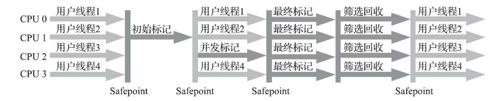

> 从G1开始，垃圾收集器的涉及到西安变为追求能够应付应用的内存分配速率，而不追求一次把整个Java堆全部清理干净。

##### G1 vs CMS

1. G1为了垃圾收集产生的内存占用（CMS卡表只保存老年代到新生代的引用）和运行时额外负载（G1使用原始快照搜算法SATB来减小最终标记时的停顿时间）都比较高。

2. 目前，在小内存应用上CMS的表现大概率由于G1，而在大内存应用上G1则能更多的发挥优势。这个优劣势的Java堆容量平衡点通常在6GB～8GB之间。

### 低延迟垃圾收集器

垃圾收集的三个重要指标：内存占用（Footprint）、吞吐量（Throughput）、延迟（Latency）。

下图为垃圾回收中各个阶段的并发情况，浅色表示必须挂起用户线程，深色表示垃圾收集和用户线程是并发的。

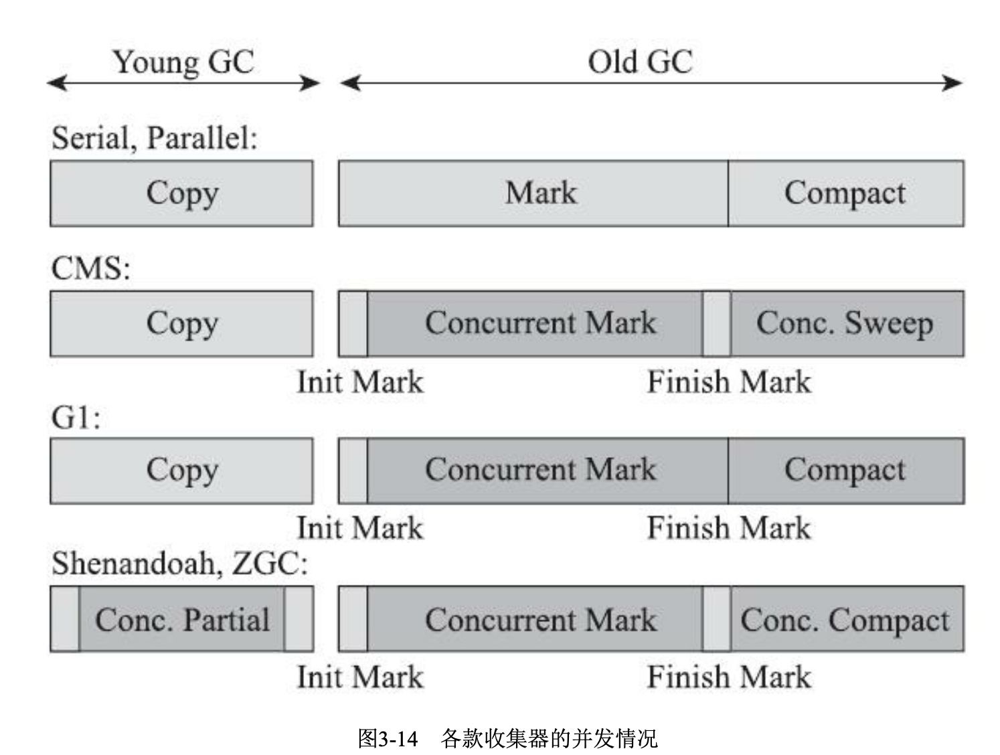

Shenandoah和ZGC都可以在任意可管理的堆容量下，实现垃圾收集的停顿时间都不超过10ms。

#### Shenandoah收集器

Redhat开发，OpenJDK中集成。但OracleJDK没有。

Shenandoah也是使用基于Region的堆内存布局，同样有着用于存放大对象的Humongous Region，默认的回收策略也同样是优先处理回收价值最大的Region。

与G1的不同：

- 支持并发整理
- 不进行分代收集（只是考虑到工作量，暂未实现）
- 不使用记忆集，使用链接矩阵记录跨Region的引用关系。

#### ZGC收集器

ZGC收集器是一款基于Region内存布局的，(暂时) 不设分代的，使用了读屏障、染色指针和内存多重映射等技术来实现可并发的标记-整理算法的，以低延迟为首要目标的一款垃圾收集器。

### 选择合适的垃圾收集器

#### Epsilon收集器

Epsilon收集器是被称为“无操作”垃圾收集器。如果Java虚拟机能正确分配内存，在堆耗尽之前就会退出，那么运行负载小，没有任何回收行为的Epsilon便很适合。

#### 收集器的权衡

三个因素：

- 应用程序的主要关注点是什么？如果是数据分析、科学计算类的任务，目标是能尽快算出结果， 那吞吐量就是主要关注点；如果是SLA应用，那停顿时间直接影响服务质量，严重的甚至会导致事务超时，这样延迟就是主要关注点；而如果是客户端应用或者嵌入式应用，那垃圾收集的内存占用则是不可忽视的。

- 运行应用的基础设施如何？譬如硬件规格，要涉及的系统架构是x86-32/64、SPARC还是ARM /Aarch64；处理器的数量多少，分配内存的大小；选择的操作系统是Linux、Solaris还是Windows 等。

- 使用JDK的发行商是什么？版本号是多少？ZingJDK/Zulu、OracleJDK、OpenJDK、OpenJ9抑或是其他公司的发行版？该JDK对应了《Java虚拟机规范》的哪个版本？

对于某个B/S系统选择垃圾回收器：

- 如果你有充足的预算但没有太多调优经验，那么一套带商业技术支持的专有硬件或者软件解决方案是不错的选择，Azul公司以前主推的Vega系统和现在主推的Zing VM是这方面的代表，这样你就可以使用传说中的C4收集器了。

- 如果你虽然没有足够预算去使用商业解决方案，但能够掌控软硬件型号，使用较新的版本，同时又特别注重延迟，那ZGC很值得尝试。

- 如果你对还处于实验状态的收集器的稳定性有所顾虑，或者应用必须运行在Windows操作系统下，那ZGC就无缘了，试 试 Shenandoah。

- 如果你接手的是遗留系统，软硬件基础设施和JDK版本都比较落后，那就根据内存规模衡量一 下，对于大概4GB到6GB以下的堆内存，CMS一般能处理得比较好，而对于更大的堆内存，可重点考察一下G1。

#### 内存分配与回收策略

- 对象优先在Eden分配
- 大对象直接进入老年代  -PretenureSizeThreshold
- 长期存活对象将进入老年代 -MaxTenuringThreshold
- 动态对象年龄判定  Survivor空间中低于或等于某年龄的所有对象大小总和大于Survivor空间的一半，年龄大于或等于改年龄的对象就可以直接进入老年代。 
- 空间分配担保 在Minor GC前，要确保老年代最大连续可用空间大于新生代所有对象的空间。如果成立，则肯定安全，如果不成立，需要通过- XX:HandlePromotionFailure参数设置值是否允许担保失败来确定。如果允许，检查老年代最大连续空间是否大于历代晋升到老年代的平均大小，如果大于，尝试MinorGC，如果小于或不允许担保，则Full GC。

## 虚拟机性能监控、故障处理工具

### 命令行工具

#### jps：虚拟机进程状况工具

`jps [options] [hostid]`

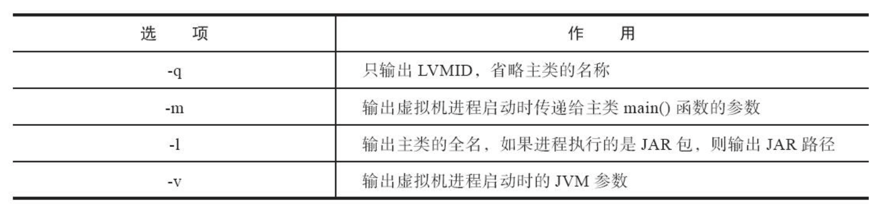

#### jstat：虚拟机统计信息监视工具

`jstat [ option vmid [interval[m|ms]] [count] ]`

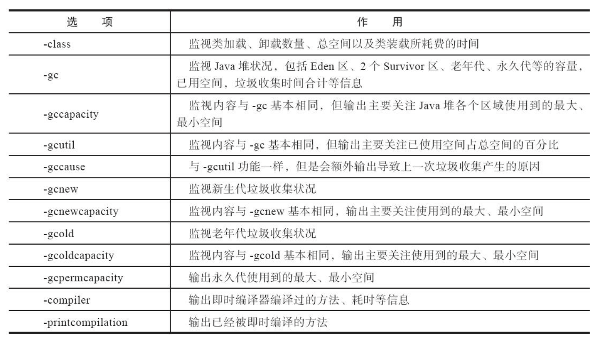

#### jinfo：Java配置信息工具

`jinfo [option] pid`

#### jmap：Java内存映像工具

`jmap [option] vmid`

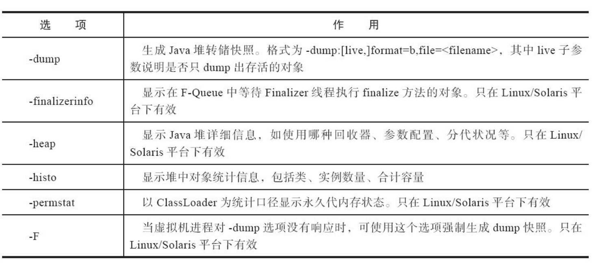

#### jhat：虚拟机堆转储快找分析工具

#### jstack：Java堆栈跟踪工具

`jstack [option] vmid`

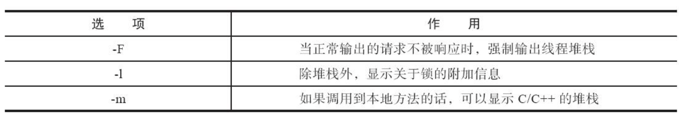

### 可视化工具

#### JHSDB：基于服务性代理的调试工具

`jhsdb hsdb --pid 11180`，也可以使用命令行打开

#### JConsole：Java监视与管理控制台

#### VisualVM：多合一故障处理工具
